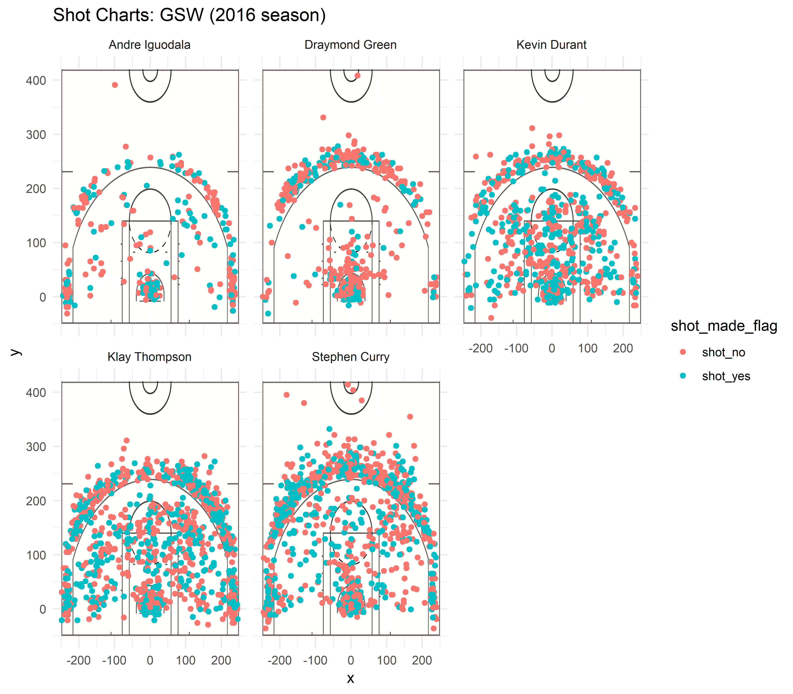

```{r, echo = FALSE, results='hide'}
datatypes <- c("team_name" = "character", "game_date" = "character", "season" = "integer", "period" = "integer", "minutes_remaining" = "integer", "seconds_remaining" = "integer", "shot_made_flag" = "character", "action_type" = "factor", "shot_type" = "factor", "shot_distance" = "integer", "opponent" = "character","x" = "integer", "y" = "integer", "name" = "character", "minute" = "integer")
shots <- read.csv("../data/shots-data.csv", stringsAsFactors = FALSE, colClasses = datatypes)
```
```{r, echo = FALSE, results='hide', message=FALSE}
library(dplyr)
```
###**Golden State Warriors 2016-2017 Season Success**

####**Introduction**
In the 2016-2017 Golden State Warriors basketball season, the Warriors won their fifth National Basketball Association (NBA) Championship. Winning 16-1, this is the best postseason record! But who are the Golden State Warriors? They are Bay Area's beloved professional basketball team based in Oakland, California! With Stephen Curry, Kevin Durant, Klay Thompson, and Draymond Green who are known as the "Fantastic Four" on the team along with Andre Iguodala, there is no doubt that they were the ones who brought the team to success. By analyzing their shot success rates throughout the season, it is clear as to why they are the five key players on the Golden State Warrior team. 

```{r out.width='80%', echo = FALSE, fig.align='center'}
knitr::include_graphics('../../../../Downloads/fivegsw.jpg')
```

####**Motivation**
Based on the 2016-2017 Golden State Warriors Roster and Stats, Stephen Curry, Kevin Durant, Klay Thompson, Draymond Green, and Andre Iguodala dominated the top five spots in all categories. This report is to show why the Golden State Warriors were as successful as they were in the 2016-2017 season by analyzing the data of the aforementioned players. I will be working with data to show with real numbers rather than just speculation for their success. 

####**Background**
In order to analyze their shot success rates, it is necessary to first gather all the data from the 2016-2017 season of each player. First task is to actually download all the data files and include the different data types that each column is to know how to manipulate the data. With this data, it is important to note which shots were successful and which shots were not in order to calculate the success rate. It is also important to compile the data of each individual player's data into a summary text file and use their individual data to pull the information of the `shot_made_flag` which indicates whether the player made or failed the shot. There is also data on the coordinates of where each shot was made, so the charts will also indicate that information. Using this information, I created each player's individual shot chart with the NBA court image in the background to indicate roughly where the shot was made on the court which I will discuss in the next section.

####**Analysis**
I combined each player's shot chart and created a table that indicates the total shots that they each made, the amount of those shots that were successful, and the percentage of the successful shots made. 

In this first table, I analyzed the data of two point field goals made by the five players. As shown, the each player's `perc_made` is higher than 40%. A good indicator for effective shooting percentages is a percentage of 40% or higher. Clearly from the table below, all the players passed this minimum with flying colors. Two of the players, Iguodala and Durant achieved a percentage of roughly 60% and above which is such an amazingly high percentage. Even the lowest effective shooting percentage of approximately 50% made by Green is still 10% higher than the minimum of 40%. 
```{r}
twopt <- arrange(
  summarise(
    group_by(shots, name), 
    total = sum(shot_type == "2PT Field Goal"),
    made = sum(shot_type == "2PT Field Goal" & shot_made_flag == "shot_yes"),
    perc_made = made/total), desc(perc_made)
)
twopt
```

The second table analyzes the effective shooting percentages of three point field goals. This time, only two players, Thompson and Curry, barely made it past the effective shooting percentage of 40%. However, the other players do not fall far behind. In fact, Durant has roughly a 39% effective shooting percentage, and Iguodala and Green only fall behind by 3% and 7%, respectively. Three pointers are further from the basket, so it makes sense for the success rate to be lower than two pointers. There could also be other confounding factors such as the period the shot was made. For example, if the shot was made in the fourth period and the minutes remaining was very low, players would be more anxious to try to make a shot at any point. Or there could be a case where the player is completely cornered, and their only option is to attempt to make that three pointer despite being in a bad position to do so. There are a multitude of possibilities for why the players' three point field goals effective shooting percentage is lower, but regardless of these reasons, they still do pretty well and very close to that 40% minimum guideline.
```{r}
threept <- arrange(
  summarise(
    group_by(shots, name), 
    total = sum(shot_type == "3PT Field Goal"),
    made = sum(shot_type == "3PT Field Goal" & shot_made_flag == "shot_yes"),
    perc_made = made/total), desc(perc_made)
)
threept
```

For the last table shown below, I gathered the data for both the two point and three point field goals. Similar to the effective shooting percentages for the two point field goals, all the players did very well overall and made a effective shooting percentage above 40%! Again, Iguodala and Durant are the top two players making an effective shooting percentage above 50%. This time the lowest effective shooting percentage is only 2% higher than the minimum, but still impressive. 
```{r}
allpt <- arrange(
  summarise(
    group_by(shots, name), 
    total = sum(shot_type == "2PT Field Goal" | shot_type == "3PT Field Goal"),
    made = sum(shot_made_flag == "shot_yes"),
    perc_made = made/total), desc(perc_made)
)
allpt
```

For the last graphic, I combined all the individual shot charts and placed them side by side. The pink dots show unsuccessful shots and the green dots show successful shots. Durant, Thompson, and Curry made the most shots overall. Although it is difficult to discern the individual dots a certain parts where it seems like a cluster of one color, it is easy to tell where each player shot more from. For example, Curry's shots are more concentrated in the three point field goal area whereas Durant and Iguodala are more concentrated in the two point field goal area. Even though Iguodala did not make as many shots as Curry, for example, he had a way higher two point field goal effective shooting percentage which shows that he made most of the shots he played in two point field goal area. Durant, who also has a high two point field goal effective shooting percentage, has shot way more basketballs than Iguodala, but Iguodala has a better percentage since he made more success for the shots he did take. 
```{r out.width='80%', echo = FALSE, fig.align='center'}

```

####**Discussion**
Based on the data, it is clear to see that it is not about the amount of shots made, but the accuracy of each shot. Even though Curry, Thompson, and Durant made the most shots, it did not correlate with their effective shooting percentage perse. Durant is definitely is successful with his two point field goals, but Iguodala did better on accuracy in that regard. So a big takeaway is that accuracy is important and that these five players are the key reason why the Golden State Warriors did so well in the 2016-2017 season.

####**Conclusion**
With such high effective shooting percentages made by each player, it is understandable and acceptable that the Golden State Warriors pulled through and ended that  2016-2017 postseason with a 16-1 win. Without the understanding and working with the data of each individual player's shot history, this would have been a baseless conclusion, however, with the data and visualizations provided, it gives a clear picture of why the Golden State Warriors were so successful in the 2016-2017 season.

#####**Reference**
*http://www.espn.com/nba/playoffs/2016/story/_/id/16342407/golden-state-warriors-complete-historic-collapse-game-7
*https://www.krossover.com/articles/effective-shooting-percentage-key-indicator-success/


