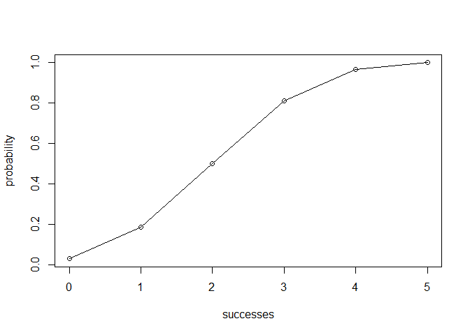

Workout 3
---------

-   Name: Melody Tran
-   Github username: melodyjt
-   Email: <melodyjt@berkeley.edu>
-   Lab section: 107
-   GSI: Dodo Qian

Overview
--------

`"binomial"` is an R package that provides functions to make different calculations on a Binomial random variable. \* `bin_choose()` calculates the number of combinations in which `k` successes can occur in `n` trials \# `bin_probability()` calculates the probability of getting `k` successes in `n` trials \* `bin_distribution()` creates a data frame after calculating the probability of each value of success in n trials with the columns success and probability \* `plot()` method for `bin_distribution()` to make a barplot of the probability of each value of success in n trials \* `bin_cumulative()` create a data frame after calculating cumulative probability of each value of success in n trials with the columns success, probability, and cumulative \* `plot()` method for `bin_cumulative()` to plot the cumulative probability in a line graph \* `bin_variable()` creates a named list for trials and probability \* `print()` method for `bin_variable()` to print out the number of trials and probability \* `summary()` method for `bin_variable()` to calculate the five different measures of a binomial distribution and put it in a named list \* `print.summary()` method for `bin_variable()` to print out the number of trials and probability along with the five different measures

Motivation
----------

This assignment involves learning how to create an R package using devtools and testthat packages.

Usage
-----

``` r
# Usage
library(binomial)

bin_choose(n = 5, k = 2)
#> [1] 10

bin_probability(success = 2, trials = 5, prob= 0.5)
#> [1] 0.3125

bin_distribution(trials = 5, prob = 0.5)
#>   success probability
#> 1       0     0.03125
#> 2       1     0.15625
#> 3       2     0.31250
#> 4       3     0.31250
#> 5       4     0.15625
#> 6       5     0.03125

dis1 <- bin_distribution(trials = 5, prob = 0.5)
plot(dis1)
```


``` r

bin_cumulative(trials = 5, prob = 0.5)
#>   success probability cumulative
#> 1       0     0.03125    0.03125
#> 2       1     0.15625    0.18750
#> 3       2     0.31250    0.50000
#> 4       3     0.31250    0.81250
#> 5       4     0.15625    0.96875
#> 6       5     0.03125    1.00000

dis2 <- bin_cumulative(trials = 5, prob = 0.5)
plot(dis2)
```



``` r

bin_variable(trials = 10, prob = 0.3)
#> "Binomial variable"
#> 
#> Parameters
#> - number of trials: 10 
#> - prob of success: 0.3

summary(bin_variable(trials = 10, prob = 0.3))
#> $trials
#> [1] 10
#> 
#> $prob
#> [1] 0.3
#> 
#> $mean
#> [1] 3
#> 
#> $variance
#> [1] 2.1
#> 
#> $mode
#> [1] 3
#> 
#> $skewness
#> [1] 0.2760262
#> 
#> $kurtosis
#> [1] -0.1238095
#> 
#> attr(,"class")
#> [1] "summary.binvar"
```
